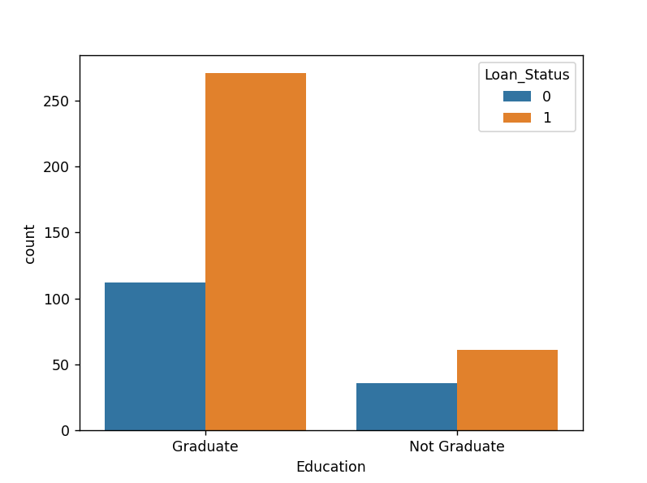
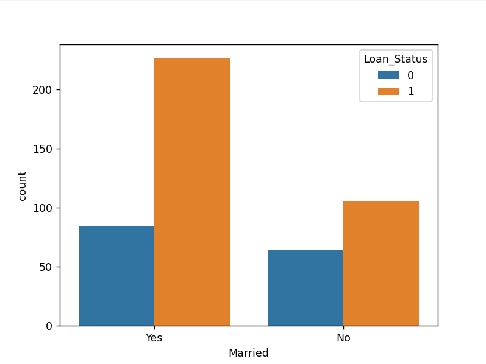

<h1>Loan Predicition</h1>
Predicting whether loan will be approved based on many features.
Used Support vector Classifier for predicition from Sklearn
The data was split into training and test data by ratio of 0.7 : 0.3
<h2> About the data</h2>
Data size: 614 rows and 13 columns.
Included Missing values.
Included Categorical values which had to be replaced.
<h2> Result</h2>
 
 

Test Data Accuracy : 77.638% 
Training Data Accuracy: 77.67%

Data: <a href="https://www.kaggle.com/datasets/ninzaami/loan-predication/download?datasetVersionNumber=1">Loan Predicition</a>